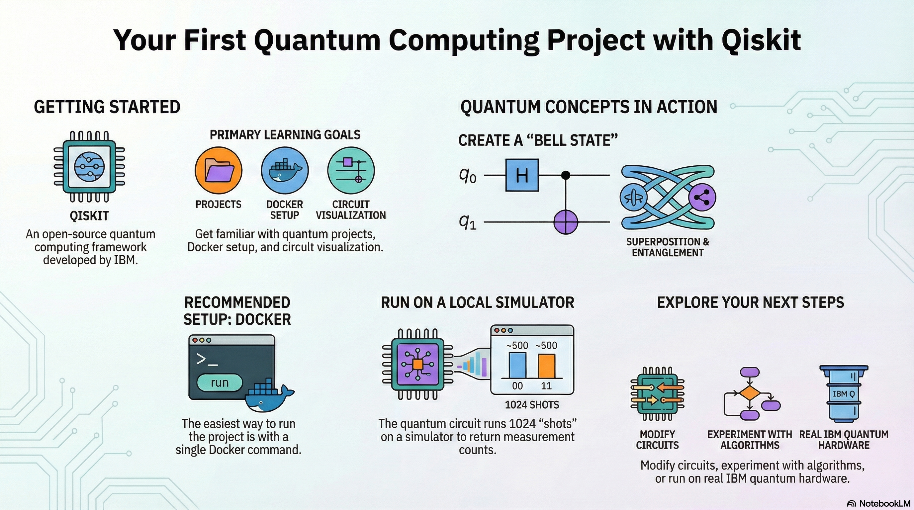
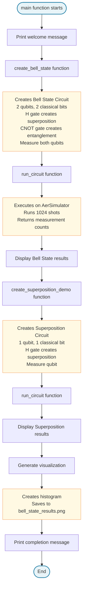

# Learn Qiskit - Your First Quantum Computing Project

This is a learning project designed to help you get started with PennyLane and quantum computing workflows.

Don't worry about understanding all the intricate quantum details at this point! The focus here is on:

✅ Getting familiar with running quantum computing projects
✅ Understanding project orchestration and setup
✅ Learning how to work with Docker containers
✅ Seeing how quantum circuits are structured and visualized
Later examples will dive deeper into the quantum components (gates, entanglement, measurements, etc.). For now, just focus on getting comfortable with the tools and workflow!


Welcome to our first Qiskit project! This is a simple starter project to help you get familiar with quantum computing using IBM's Qiskit framework.



## Platform Compatibility

**Tested on:** Windows 11 (AMD processor)  
**Docker:** Works on Windows, Linux, and macOS  
**Local Python:** May require platform-specific adjustments for Linux and macOS

This project has been developed and tested on a **Windows AMD machine**. While Docker provides excellent cross-platform compatibility, if you're running locally on Linux or macOS, you may need to make minor adjustments:

- **Linux/macOS:** Use forward slashes (`/`) instead of backslashes (`\`) in paths
- **macOS:** May need to use `python3` instead of `python` command
- **Linux:** May require additional system dependencies for matplotlib visualization
- **Docker:** Works identically across all platforms (recommended)

For the best cross-platform experience, we recommend using Docker (see Quick Start section below).

## What is Qiskit?

Qiskit is an open-source quantum computing framework developed by IBM. It allows you to:
- Create and run quantum circuits
- Simulate quantum algorithms locally
- Run experiments on real quantum hardware (optional)

## Project Contents

- `hello_quantum.py` - A simple example demonstrating:
  - Creating quantum circuits
  - Applying quantum gates (Hadamard, CNOT)
  - Creating Bell states (quantum entanglement)
  - Running circuits on a simulator

## Architecture

The following diagram shows the structure and flow of `hello_quantum.py`:



> **Note:** This diagram uses Mermaid syntax and will render automatically on GitHub. You can preview it before pushing by:
> - Testing at [mermaid.live](https://mermaid.live) (paste the code above)
> - Using a Mermaid viewer extension in VS Code or other IDEs
> - Viewing directly on GitHub after pushing your repository

## Quick Start with Docker (Recommended - No Python Installation Needed!)

If you have Docker installed, this is the easiest way to run the project:

### Option A: Using Docker Compose (Easiest)

```bash
# Build and run the project
docker-compose up --build

# Or run interactively
docker-compose run --rm qiskit python hello_quantum.py
```

### Option B: Using Docker Directly

**Windows PowerShell:**
```powershell
.\docker-run.ps1
```

**Windows Command Prompt:**
```cmd
docker-run.bat
```

**Linux/macOS:**
```bash
chmod +x docker-run.sh
./docker-run.sh
```

### Option C: Manual Docker Commands

**Windows (PowerShell/CMD):**
```powershell
# Build the image
docker build -t learn-qiskit .

# Run the project
docker run --rm learn-qiskit python hello_quantum.py

# Or run interactively (for experimentation)
docker run -it --rm -v ${PWD}:/app learn-qiskit bash
```

**Linux/macOS:**
```bash
# Build the image
docker build -t learn-qiskit .

# Run the project
docker run --rm learn-qiskit python hello_quantum.py

# Or run interactively (for experimentation)
# Note: Use $PWD on Linux/macOS instead of ${PWD}
docker run -it --rm -v $(pwd):/app learn-qiskit bash
```

**Note:** Make sure Docker Desktop (Windows/macOS) or Docker Engine (Linux) is installed and running. Download from [docker.com](https://www.docker.com/products/docker-desktop/)

---

## Setup Instructions (Local Python Installation)

### 1. Install Python

Make sure you have Python 3.8 or higher installed. You can check by running:
```bash
python --version
```

**If Python is not installed:**

**Windows (Tested Platform):**
1. Download Python from [python.org](https://www.python.org/downloads/)
2. **Important:** During installation, check "Add Python to PATH"
3. Choose "Install Now" or customize installation
4. Verify installation by opening a new terminal and running `python --version`

**Alternative for Windows (using Microsoft Store):**
- Open Microsoft Store
- Search for "Python 3.11" or "Python 3.12"
- Click "Install"
- After installation, restart your terminal

**Linux:**
```bash
# Ubuntu/Debian
sudo apt update
sudo apt install python3 python3-pip python3-venv

# Fedora/RHEL
sudo dnf install python3 python3-pip

# Arch Linux
sudo pacman -S python python-pip
```

**macOS:**
```bash
# Using Homebrew (recommended)
brew install python3

# Or download from python.org
# Note: You may need to use 'python3' instead of 'python' command
```

### 2. Create a Virtual Environment (Recommended)

**Windows (PowerShell):**
```powershell
# Create virtual environment
python -m venv venv

# Activate virtual environment
venv\Scripts\activate
```

**Windows (CMD):**
```cmd
python -m venv venv
venv\Scripts\activate.bat
```

**Linux/macOS:**
```bash
# Create virtual environment
# Note: May need to use 'python3' instead of 'python' on macOS/Linux
python3 -m venv venv

# Activate virtual environment
source venv/bin/activate
```

### 3. Install Dependencies

```bash
pip install -r requirements.txt
```

### 4. Run the Example

```bash
python hello_quantum.py
```

## Do I Need a Qiskit API Key?

**Short answer: No, not for this project!**

This project uses Qiskit's **local simulators** (via `qiskit-aer`), which run entirely on your computer. You don't need any API keys or internet connection to run the examples.

### When Would You Need an API Key?

You only need an IBM Quantum API key if you want to:
- Run circuits on **real quantum hardware** (IBM's quantum computers)
- Access advanced features like quantum cloud services
- Use IBM Quantum Network features

### Getting an API Key (Optional - For Future Use)

If you want to explore real quantum hardware later:

1. Go to [IBM Quantum](https://quantum-computing.ibm.com/)
2. Sign up for a free account
3. Get your API token from the dashboard
4. Save it using:
   ```bash
   qiskit config --set ibm_quantum_token YOUR_API_TOKEN
   ```
   Or set it in your code:
   ```python
   from qiskit import IBMQ
   IBMQ.save_account('YOUR_API_TOKEN')
   ```

## What You'll Learn

After running this project, you'll understand:
- How to create quantum circuits
- Basic quantum gates (Hadamard, CNOT)
- Quantum superposition
- Quantum entanglement (Bell states)
- How to run and measure quantum circuits

## Next Steps

Once you're comfortable with this example, you can:
- Modify the circuits to experiment with different gates
- Try creating your own quantum algorithms
- Explore more advanced Qiskit features
- Learn about quantum algorithms (Grover's, Shor's, etc.)
- Eventually run on real quantum hardware (requires API key)

## Resources

- [Qiskit Documentation](https://qiskit.org/documentation/)
- [Qiskit Textbook](https://qiskit.org/learn/)
- [IBM Quantum Lab](https://quantum-computing.ibm.com/lab)

## Troubleshooting

### Docker Issues

**Issue: Docker command not found**
- Make sure Docker Desktop is installed and running
- Verify Docker is in your PATH: `docker --version`

**Issue: Permission denied (Linux)**
- Add your user to the docker group: `sudo usermod -aG docker $USER`
- Log out and log back in

**Issue: Container fails to build**
- Make sure you're in the project directory
- Check that `requirements.txt` exists
- Try: `docker build --no-cache -t learn-qiskit .`

### Local Python Issues

**Issue: Import errors**
- Make sure you've installed all dependencies: `pip install -r requirements.txt`
- Verify your virtual environment is activated

**Issue: Visualization not working**
- Make sure matplotlib is installed: `pip install matplotlib`
- **Windows:** Usually works out of the box
- **Linux:** May need: `sudo apt-get install python3-tk` (Ubuntu/Debian) or `sudo dnf install python3-tkinter` (Fedora)
- **macOS:** Usually works, but may need: `brew install python-tk` if using Homebrew Python

## License

This is a learning project. Feel free to modify and experiment!


